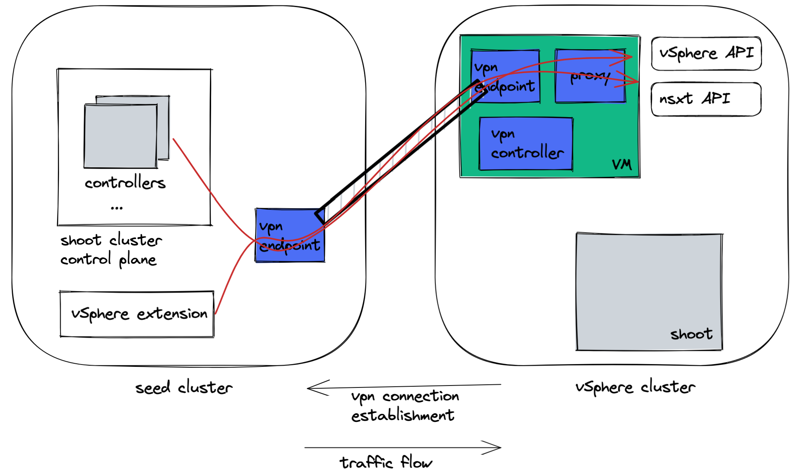

# GEP-21: Cloud Provider API Endpoint VPN

## Table of Contents

- [Summary](#summary)
- [Motivation](#motivation)
    - [Goals](#goals)
    - [Non-Goals](#non-goals)
- [Proposal](#proposal)
- [Alternatives](#alternatives)

## Summary

Cloud provider API endpoints must be routable from controllers which are deployed in the seed cluster. This is true for public environments such as the hyperscalers and in private or controlled environments. If there is no direct connectivity there are two major ways to deploy Kubernetes clusters in those environments. The first way is to establish a VPC peering or a VPN between the seed cluster network and the network of the cloud provider API. The second way is to deploy a seed cluster in the private cloud environment via a cluster that is native to that environment. Today there are several private environments where clusters are deployed using one of these two mechanisms.

## Motivation

While both approaches work well in productive environments, there are a couple of obstacles. Both approaches are tedious to set up, may require significant extra- and sometime manual effort, are error prone, and can potentially cause security issues if not set up correctly. In addition, with private environments, some components of the Gardener infrastructure might not be under control of the Gardener SRE team anymore which is problematic as it may contain secrets private to Gardener.

This enhancement proposal describes a mechanism for transparently establishing a VPN so the controllers in the seed cluster can route requests to the cloud provider endpoints eliminating the need to set up a static VPN or deploy private seed clusters into those environments. 

### Goals

Provide a mechanism and implementation for a VPN from the seed cluster to the cloud provider API endpoints. Initially OpenStack and VMware are the target cloud infrastructures. 

### Non-Goals

## Proposal

The first diagram shows the current situation for vSphere: the vSphere and NSX-T APIs are routable for the extensions and controllers in the seed cluster. If the vSphere environment is in a private environment network connectivity must be established manually. The diagram for OpenStack would look similar.


A high-level picture of the proposal is shown below.



Upon creation of a shoot cluster the cloud provider extension creates a VPN service endpoint in the seed for the environment where the shoot is going to be deployed (if it does not exist already). Controllers that need access to the cloud provider APIs are configured with a proxy pointing to the VPN endpoint. The VPN endpoint just uses a port forward rule to forward requests to the other side of the tunnel where a proxy server is running.

A controller in the cloud provider environment watches for these endpoints and establishes connectivity to that endpoint once it has been created. Next to the tunnel endpoint a proxy is started that forwards API requests to the cloud provider endpoints as DNS name resolution might only work in the private cloud environment. 

### Implementation Details

For vSphere a `cloudProviderVPN` key to the `spec.regions[]` section in the vSphere cloud provider and set it to `true`. For OpenStack this key is added to the `spec.providerConfig.keystoneURLs[]` section.

This will trigger the following actions:

1. A service account for the respective cloud provider is created with limited access. The cloud provider will only have access to VPN configurations and secrets dedicated for that particular cloud provider.

TODO: implementation for enforcing of this requirement still open.

2. During cluster creation a CloudProviderAPIVPN resource will be created:

```
apiVersion: core.gardener.cloud/v1beta1
kind: CloudProviderAPIVPN
metadata:
  name: vpn-<<seed-name>>-<<cloud-provider-profile-name>>
spec:
  seedName: <<name where the control plane is deployed on>>
  cloudProfileName: <<name of the cloud profile>>
```

TODO: it is unclear whether this resource should be created by Gardener or the cloud provider extension. Apparently, those resources shall be created by Gardener today, but Gardener does not and probably should not have semantic knowledge of the structure of the cloud profile resource. 

A new `cloud-provider-api-vpn-extension` picks up this resource and creates the VPN endpoint on the respective seed cluster. It will also generate the secrets (one for the seed cluster and one for the cloud provider) and add links to them to the resource.

TODO: the way the secrets are going to be linked is still unclear. 

TODO: it appears possible to re-use some aspects of the reversed cluster VPN described in [GEP-14](https://github.com/gardener/gardener/blob/master/docs/proposals/14-reversed-cluster-vpn.md). Details need to be agreed upon.

### The VM deployed on the cloud provider

The purpose of the VM that is deployed on the cloud provider is to listen for `CloudProviderAPIVPN` resource changes and dynamically create, modify, or delete vpn connections to the seed cluster as well as to host the proxy.

The idea is to provide an initialization script for Garden Linux with the service account secret. This script would instantiate Docker containers which would provide the implementation.

TODO: specify requirements to monitor the health of this VM and re-deploy if it fails. It is also perceivable that multiple instances are set up for this VM.

Discussion: having a VM appears awkward at first sight, however this is what networking people do all the time. We discussed hosting the VPN client inside a Kubernetes cluster, but this would increase complexity by several orders of magnitude. It also does not appear necessary: even a VPN outage of several minutes would most likely not impact running workload. It would impact reconciliation, as well as prevent new resources from being created (disks, VMs, load balancers).

### Security Considerations

Security must be considered for two domains: the seed cluster as well as the cloud provider. As the cloud provider is outside of the Gardener domain it must be considered as a foreign and untrusted environment in the context of a Gardener landscape.

For the seed cluster as part of the Gardener environment we don't see a security impact at all. Although external attackers could establish VPN connections by stealing cloud provider secrets, they would not be able to exploit that as no network traffic is allowed into the seed cluster.

The situation can be different for the cloud provider and requires further discussion:

- The proxy in the cloud provider environment will be configured in a way to only forward API requests to the cloud provider endpoints. This mechanism can therefore not be exploited to access arbitrary resources in the cloud provider or the cloud provider network. 

- When comparing the situation of a cloud provider connected via VPC peering or a traditional VPN we don't see any difference in terms of security apart that the VPN created my means described in this enhancement request are probably more secure as it precisely limits access to the required endpoints.

- When comparing this proposal to a scenario where a seed cluster is deployed using some cloud provider means (soil cluster) the situation is different. When working with soil clusters Kubernetes APIs of clusters created in the cloud environment remain private to that environment. Clusters deployed with this proposal will have their Kubernetes API Servers in a public environment which potentially opens ways to the private network environment.
 
## Alternatives

Alternatives are discussed at the beginning of this document and are in production today. Due to their limitations this proposal has been created.
